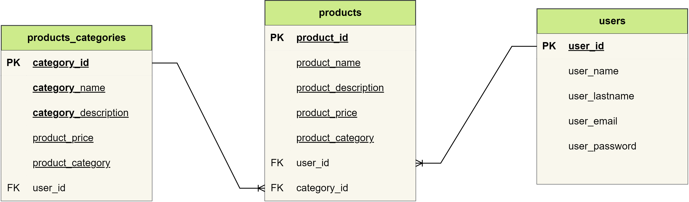
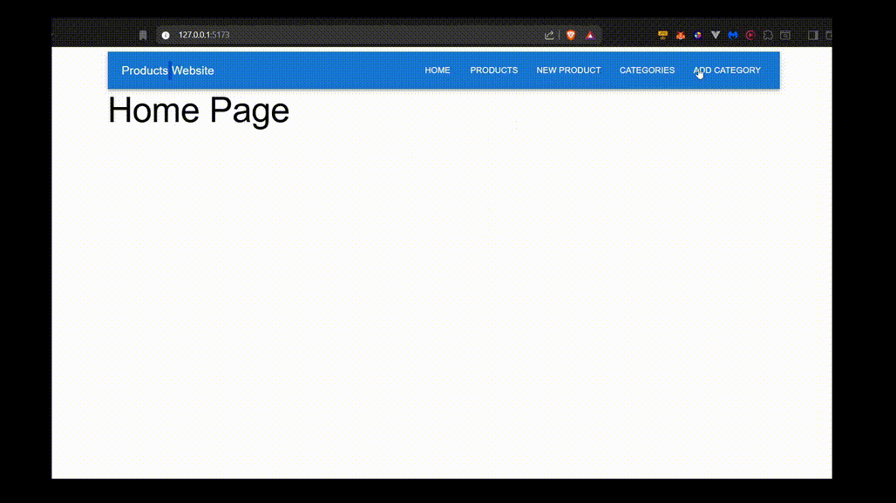
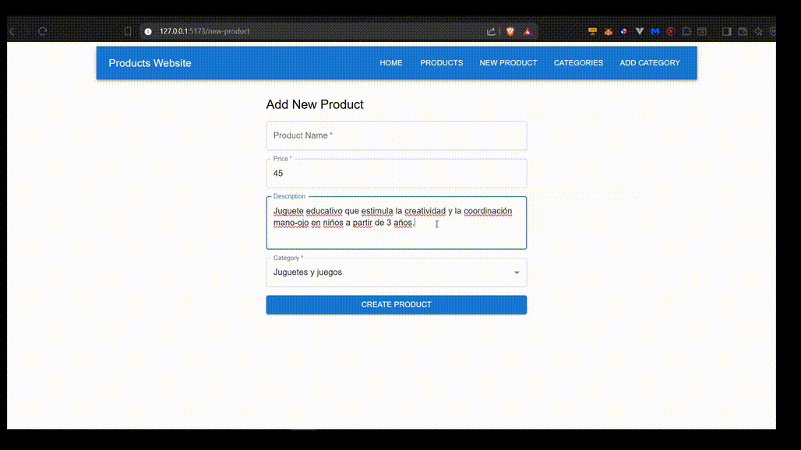
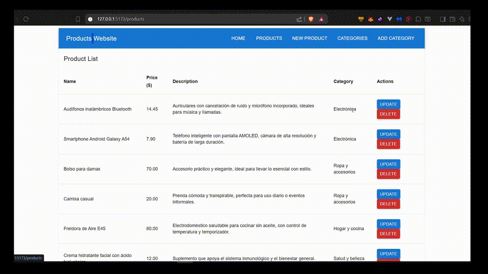
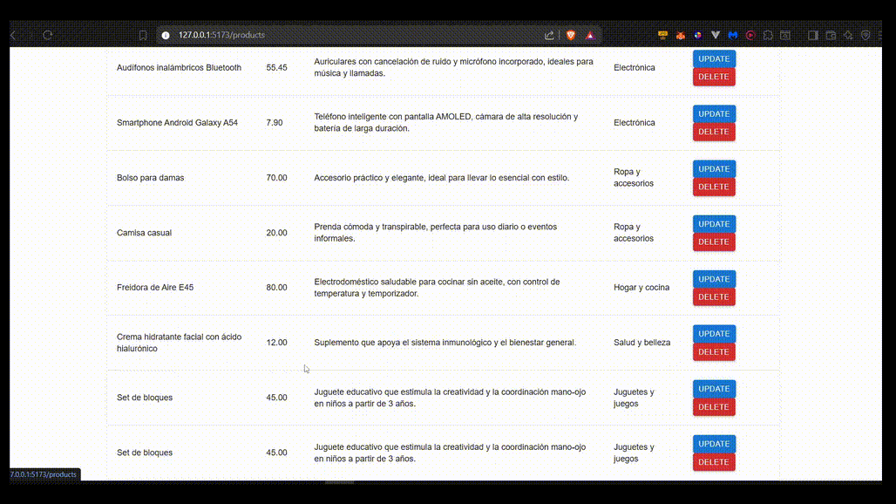

# Product Management Dashboard

An intuitive web-based application that allows businesses to manage their product inventory efficiently and securely through a user-friendly interface. This system enables teams to create, update, and remove product entries, ensuring a streamlined and organized product database.

---

## 🌟 Key Features

- **Add New Products** – Easily register new items with relevant details.
- **Edit Product Information** – Keep your product data up to date.
- **Remove Outdated Products** – Clean up inventory with one click.
- **Dashboard Navigation** – Smooth and accessible interface to browse and manage your catalog.

---

## 🧩 Use Case

This application is designed for small to mid-sized businesses that need a reliable tool for maintaining accurate and current product data. It enables teams to manage product-related information directly from the web interface, reducing manual processes and minimizing errors.

Whether you're updating product prices, adding new items, or retiring discontinued lines, this tool provides the control and visibility.

---

## 🗂️ Database Model

Below is the entity-relationship diagram representing how product information and related entities like products categories and users are stored and connected:

📊 **Entity-Relationship Diagram:**



---

## 📽️ Application Showcase

Explore how the system works through the examples below:

---

### 🔹 Navigation


---

### 🔹 Create a New Product



---

### 🔹 Update an Existing Product



---

### 🔹 Delete a Product



---

## 🚀 Getting Started

1. Clone this repository.
```bash
git clone https://github.com/tonijkhl/crud-products.git
```
2. Configure database access in the environment (`.env`) file.
3. Run the backend server and launch the frontend.
```bash
cd backend
npm run dev # run the dev server
```
```bash
cd frontend
npm run dev # run the dev server
```
4. Access the application via your browser.
`http://localhost:5173/`
---